# **Routing in Azure Virtual WAN MicroHack**

# Contents
[Introduction](#introduction)

[Objectives](#objectives)

[Scenario](#scenario)

[Lab](#lab)

[Prerequisites](#prerequisites)

[Scenario 1: Single region Virtual WAN with Default Routing](#scenario-1-single-region-virtual-wan-with-default-routing)

[Scenario 2: Add a branch connection](#scenario-2-add-a-branch-connection)

[Scenario 3: Multi-regional Virtual WAN](#scenario-3-multi-regional-virtual-wan)

[Scenario 4: Isolated Spokes and Shared Services Spoke](#scenario-4-isolated-spokes-and-shared-services-spoke)

[Scenario 5 (Optional): Filter traffic through a Network Virtual Appliance](#scenario-5-optional-filter-traffic-through-a-network-virtual-appliance)

[Scenario 6 (Optional): Secured Hubs](#scenario-6-optional-secured-hubs)

[Close out](#close-out)

# Introduction

Azure Virtual WAN can be a core component in a customer's Azure foundation. In [this article](https://docs.microsoft.com/en-us/azure/cloud-adoption-framework/ready/enterprise-scale/network-topology-and-connectivity), the Enterprise Scale Framework explains how Virtual WAN may be used to create a network topology underpinning customer's foundation.

It is therefore important to understand how Virtual WAN enables connectivity within Azure. The purpose of this MicroHack is to build that understanding by exploring some of the routing capabilities recently introduced. 

The lab starts with a single Hub with Spoke VNETs and default routing. We then connect a simulated on-premise location via S2S VPN. Then we add another regional Hub with Spokes and observe how routing extends across multiple Hubs. Next we implement custom routing patterns for Shared Services- and Isolated Spokes.

At the end of the MicroHack there is optional content on network security with NVAs and Azure Firewall. Although this is insightful already, it is not yet possible to build a scenario in which 
VNET-to-VNET traffic across multiple hubs is [secured through Azure Firewall](https://docs.microsoft.com/en-us/azure/virtual-wan/scenario-route-between-vnets-firewall).

Prior to starting this MicroHack, please familiarize yourself with routing in Virtual WAN by reviewing the [documentation](https://docs.microsoft.com/en-us/azure/virtual-wan/about-virtual-hub-routing).

# Objectives
After completing this MicroHack you will:
-	Know how to build a hub-and-spoke topology with Virtual WAN
-	Understand default routing in Virtual WAN and how this differs from the classic virtual data center hub-and-spoke spoke architecture 
-	Understand how custom routing works and know how to build some custom routing scenarios

# Lab

The lab consists of a Virtual WAN with Hubs in West Europe and US East, 4 Spoke VNETs (2 in West Europe, 1 in US East and 1 US West), a Shared Services VNET in West-Europe and a simulated On-premise location in North Europe. 

Each of the Spoke and On-prem VNETs contains a Virtual Machine running a basic web site. The Shared Services VNET contains an Active Directory Domain Controller. the NVA VNET contains a Linux VM with Iptables.

An additional VNET containing a Network Virtual Appliance Linux-based firewall is also deployed. This NVA VNET is used in the optional advanced scenario's on network security.

During the course of the MicroHack you will connect the Spoke and Shared Services VNETs and the On-premise site to Virtual WAN, deploy an additional Virtual WAN Hub, and manipulate and observe routing. 

At the end of the lab your deployment looks like this:

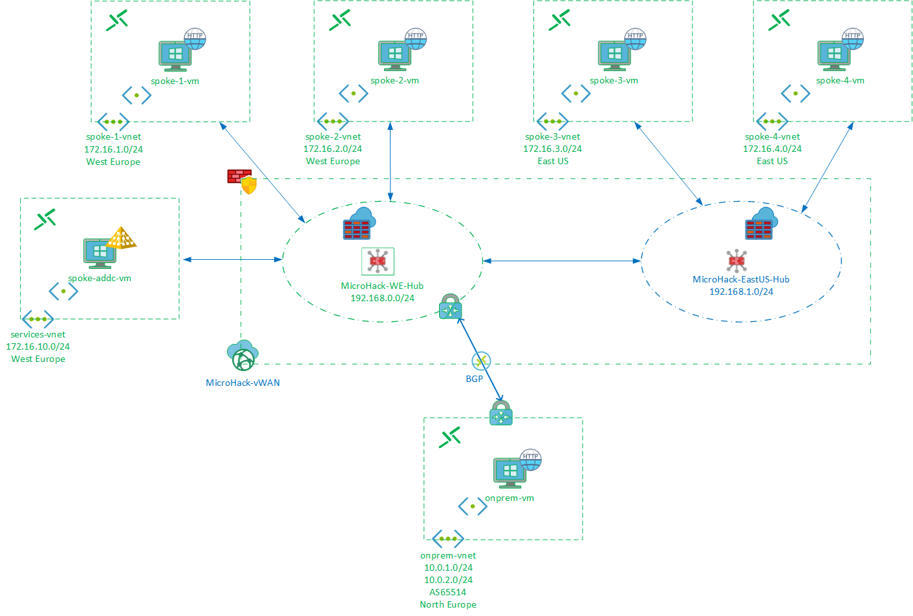

Although a Branch (site-to-site VPN) connection is part of this MicroHack, it does not cover the integration with products from  SDWAN partners.

:exclamation: The resources deployed in this lab incur a combined charge of around $40 per day, so do remember to delete the environment when done!

# Prerequisites
To make the most of your time on this MircoHack, the green elements in the diagram above are deployed and configured for you through Terraform. You will focus on deploying and configuring the blue items using the Azure portal and Cloud Shell.
## Task 1: Deploy
Steps:
- Log in to Azure Cloud Shell at https://shell.azure.com/ and select Bash
- Ensure Azure CLI and extensions are up to date:
  
  `az upgrade --yes`
  
- If necessary select your target subscription:
  
  `az account set --subscription <Name or ID of subscription>`
  
- Clone the  GitHub repository:
  
  `git clone https://github.com/mddazure/azure-vwan-microhack`
  
  - Change directory:
  
  `cd ./azure-vwan-microhack`
  - Initialize terraform and download the azurerm resource provider:

  `terraform init`

- Now start the deployment (when prompted, confirm with **yes** to start the deployment):
 
  `terraform apply`

Deployment takes approximately 30 minutes. 
## Task 2: Explore and verify

After the Terraform deployment concludes successfully, the following has been deployed into your subscription:
- A resource group named **vwan-microhack-spoke-rg** containing
  - Four Spoke VNETs, each containing a Virtual Machine running a simple web site, and a Bastion Host.
  - An Onprem VNET containing a Virtual Machine running a simple web site, a VNET Gateway and a Bastion Host.
  - A Services VNET containing and a Virtual Machine configured as an Active Directory Domain Controller, and a Bastion Host.
  - An NVA VNET containing a Virtual Machine with Linux (Ubuntu 18.4) and Iptables installed, and a Bastion Host.
- A resource group named **vwan-microhack-hub-rg** containing a Virtual WAN resource with one Hub and one VPN Gateway. You will deploy another Hub into this resource group manually later on.

Verify these resources are present in the portal.

Credentials are identical for all VMs, as follows:
- User name: AzureAdmin
- Password: Microhack2020
- Domain: micro-hack.local (this is on the ADDC VM only, the other VMs are not joined to this domain yet)

You may log on to each VM through Bastion. Disable IE Enhanced Security Configuration in Server Manager, open Internet Explorer and access http://localhost. You will see  a blank page with the VM name in the upper left corner. When logging on to the ADDC VM before it is ready, you will see "Waiting for the Group Policy Client". That is OK, just let it run while you proceed with the lab.
# Scenario 1: Single Region Virtual WAN with Default Routing

In this scenario you connect in-region VNETs to the pre-deployed Hub, and establish VNET-to-VNET communication. You will then inspect effective routes on the spoke VMs and take a look at the VWAN Default routing table.
## Task 1: Baseline
Connect to spoke-1-vm via Bastion, turn off IE Enhanced Security Configuration in Server Manager, open Internet Explorer and attempt to connect to spoke-2-vm at 172.16.2.4.

:question: Does it connect?

Check the routing on spoke-1-vm, as follows:

In the portal, in the Properties view of the VM Overview blade, click on Networking. Then click on the name of the Network Interface. The NIC overview shows, under Support + troubleshooting click Effective routes.

Alternatively, in Cloud Shell, issue this command:

`az network nic show-effective-route-table -g vwan-microhack-spoke-rg -n spoke-1-nic --output table`

:question: Is there a specific route for spoke-2-vnet (172.16.2.0/24)?

## Task 2: Connect VNETs
In the portal, navigate to the Virtual WAN named **microhack-vwan** in resource group **vwan-microhack-hub-rg**. 

Click "Virtual network connections" under "Connectivity" and click "+ Add connection" at the top of the page.

Name your connection **spoke-1-we**, select the hub (microhack-we-hub) and in the Resource group drop down select **vwan-microhack-spoke-rg**. In the Virtual network drop down, select **spoke-1-vnet**.

Under Routing configuration, select:
- Associate Route Table: Default
- Propagate to Route Tables: Default
- Propgate to labels: default

Wait for the connection to reach status Succeeded, and do the same for **spoke-2-vnet**.
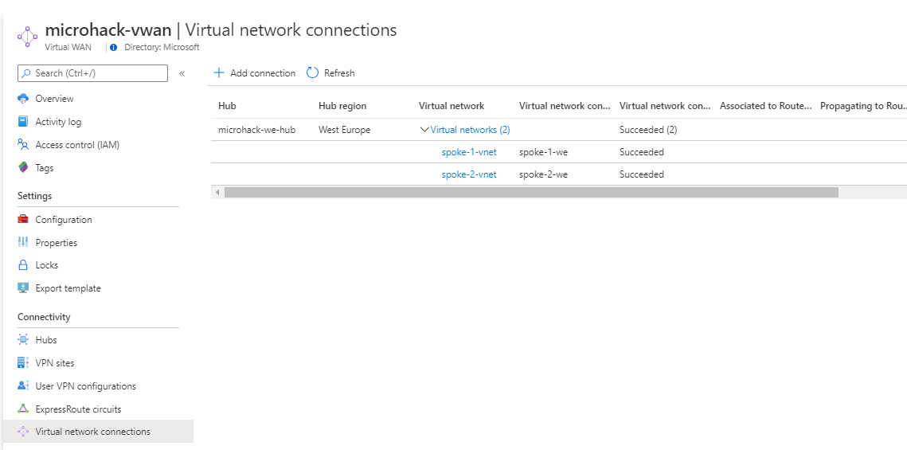

Your Virtual WAN now looks like this:

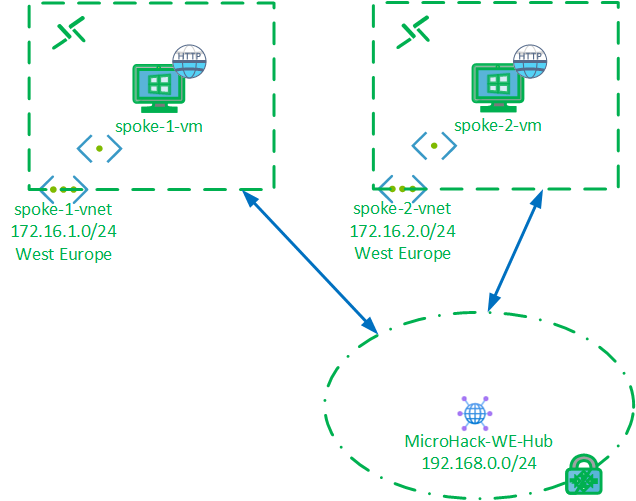

:question: Can you now browse from spoke-1-vm to spoke-2-vm and vice versa?

### :point_right: Spoke routes
Again observe Effective routes for spoke-1-vm.

:exclamation: Notice it now has a route for spoke-2-vnet (172.16.2.0/24), pointing to a public address. This is the address of the Route Service, deployed into the Hub to enable routing between peered VNETs, branch connections and other Hubs. The fact that this is a public IP address does not present a security risk, it is not reachable from the internet.

:exclamation: Notice that the routes that enable spoke-to-spoke communication were **plumbed into the spoke VNETs automatically.** Contrast this with a "classic" hub-and-spoke architecture, where you would need to set up a routing device in the hub VNET and then put UDRs in each of the spokes manually.

### :point_right: Hub routes
Navigate to the blade for the microhack-we-hub in your Virtual WAN and select Routing under Connectivity. Notice there are two Route tables present now: Default and None.

Click on Effective Routes. In the drop downs on the next page, select Route Table and Default respectively. This brings up the Default route table. 

:exclamation: Note that routes for the prefixes of both connected VNETs are present, pointing to the respective VNET connections.

Go back up to the microhack-vwan overview page, and click Virtual network connections under Connectivity. In the table, under Virtual network, click ">" to view the individual VNET connections.

A Virtual WAN can contain multiple Route tables, and we'll add some in the course of this MicroHack. Each Connection (Hub-to-Spoke VNET, ExpressRoute, S2S (Branch) VPN or P2S (User) VPN) can be *Associated* with a single table and be *Propagating* to multiple tables.

:exclamation: The Default table has Associated Connections and Propagating Connections. Both Spoke VNETs are Associated with and Propagating to the Default table.

*Propagating* means that the Connection's destinations are entered into this Routing table: the table learns the Connection's routes. 

*Associated* means that traffic from the Connections listed is governed by this table, in this case the Default route table. This table decides where traffic sent from the connection to the VWAN Route Service (remember the route entry pointing to the public IP address in the Spoke VM's Effective Routes) goes.

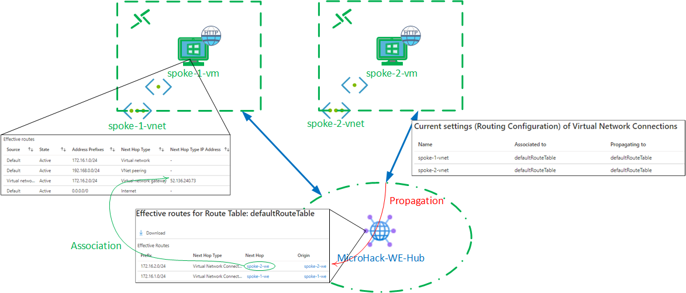

The None Route table is also present for each Hub; traffic from Connections Associated with this Route table is dropped. 

# Scenario 2: Add a branch connection

Now connect a branch site via a BGP-enabled VPN connection and explore the routing between spokes and the branch. The branch site is simulated through a VNET with a VNET Gateway which was deployed through Terraform as part of the Prerequisites.

## Task 1: Connect a simulated branch site
We are simulating a Branch site by means of a VNET with a VNET Gateway. In reality this would be a VPN device manufactured by one of the [Virtual WAN Partners](https://docs.microsoft.com/en-us/azure/virtual-wan/virtual-wan-locations-partners), and you would use the automation provided by Virtual WAN to configure the device.

In Cloud Shell, in the azure-vwan-microhack directory
- Run the connect-branch shell script:

`./connect-branch.sh`

The script contains Azure CLI commands that create following resources:
- A VPN Site named "onprem" in the Virtual WAN
- A BGP-enabled VPN connection from the "onprem" site to the West Europe Hub
- A Local Network Gateway named "lng" to represent the West Europe Hub
- A BGP-enabled VPN connection from the Gateway in "onprem-vnet" to the Local Network Gateway

After the script completes, it may take a few minutes for the connection to show "Connected" in the portal.

Your Virtual WAN now looks like this:

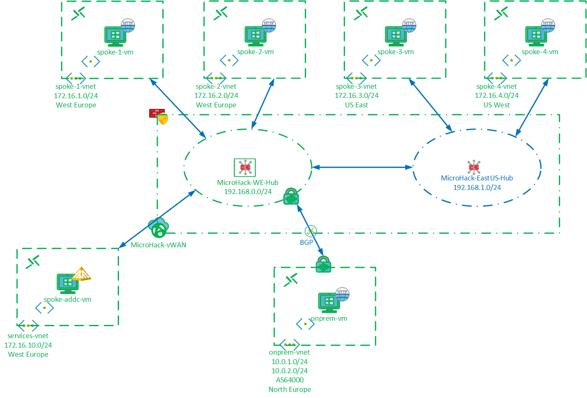

## Task 2: Verify connectivity
Connect to onprem-vm via Bastion and turn off IE Enhanced Security Configuration in Server Manager.

Open Internet Explorer and browse to spoke-1-vm at 172.16.1.4 and spoke-2-vm at 172.16.2.4.

:question: Does it connect?
## Task 3: Inspect routing
### :point_right: BGP routing exchange over VPN
In Cloud Shell, in the azure-vwan-microhack directory, run the branch-routes script:

`./branch-routes.sh`

This scripts pulls information on the BGP session from the VNET Gateway vnet-onprem-gw. 

:exclamation: Note that the "routes learned" output contains all routes the Gateway knows: those that are in the same VNET, with "origin" indicating "Network", as well as routes learned from the Virtual WAN Hub via BGP with "origin" indicating "EBgp". 

### :point_right: Branch routes
Now observe Effective Routes for onprem-vm.

 In the portal, in the Properties view of the VM Overview blade, click on Networking. Then click on the name of the Network Interface. The NIC overview shows, under Support + troubleshooting click Effective routes.

 Alternatively, in Cloud Shell, issue this command:

`az network nic show-effective-route-table -g vwan-microhack-spoke-rg -n onprem-nic --output table`

:exclamation: Note that routes are present for the Spoke VNETs, pointing to the local VNET VPN Gateway. 

The VNET Gateway learned the routes for the Spoke VNETs via BGP and programmed them into the vm route table automatically, without the need to install UDRs.

### :point_right: Spoke routes
Observe Effective Routes for spoke-1-vm:

`az network nic show-effective-route-table -g vwan-microhack-spoke-rg -n spoke-1-nic --output table`

:exclamation: Notice that spoke-vm-1 now has routes for the IP ranges of the onprem site, 10.0.1.0/24 and 10.0.2.0/24. This site is connected via VPN, and although "Source" and "Next Hop Type" are the same as for peered VNET spoke-2-vnet, the next hop address is different.
 
Whereas the next hop for spoke-vnet-2 is the Hub routing engine, the next hop for VPN connection is the VPN Gateway, which has a private IP address from the range assigned to Hub.

The routes for the VPN connection where plumbed into the spoke automatically and there is no need to place User Defined Routes in the spoke VNETs.

### :point_right: Hub routes
Observe the Effective routes of the Default route table. 

:exclamation: Note that routes for the on-prem site's prefixes are now present, pointing to S2S VPN Gateway. 

Realize that the Route Service itself is not in the data path for branch traffic. The Route Service acts as a route reflector, traffic flows directly between the VM in the spoke and VPN Gateway.

# Scenario 3: Multi-regional Virtual WAN
We will now expand the Virtual WAN across regions by adding a Hub with Spokes in the US East region. 

A key take away from this scenario is that each hub runs its own routing instance and contains its own routing tables.

Although routing tables may be called the same across Hubs, Default for example, it is important to realize that these are independent and there is no "global" routing table spanning the entire VWAN. Labels are used to group routing tables, serving as Propagation targets across hubs.

At the end of this scenario, your lab looks like this:

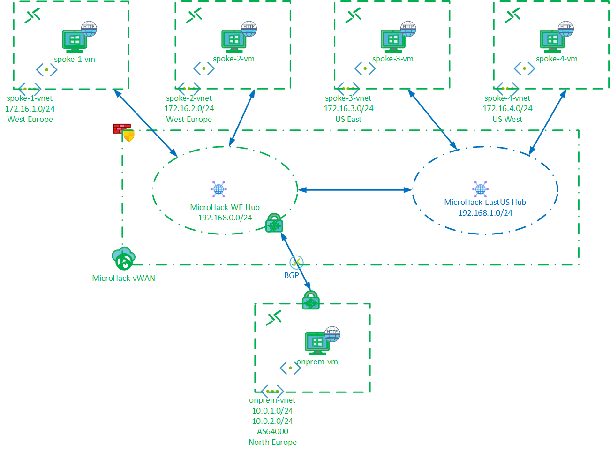

## Task 1: Add a Hub

In the portal, Select your **microhack-vwan**. Under Connectivity, select Hubs, then +New Hub at the top of the page and complete the Basics dialog as follows:
- Region: East US
- Name: microhack-useast-hub
- Hub private address space: 192.168.1.0/24

As this Hub will not contain any gateways, skip the other tabs, click Review + create and then Create.

Alternatively, in Cloud Shell, issue this command:

`az network vhub create --address-prefix 192.168.1.0/24 --name microhack-useast-hub --vwan microhack-vwan --resource-group vwan-microhack-hub-rg --location eastus --sku Standard`

This will take a few minutes to complete. 

## Task 2: Connect VNETs
Connect spoke-3-vnet and spoke-4-vnet to the new Hub. We connected VNETs through the portal in Scenario 1, so to save time we'll do this through a prepared shell script.

In Cloud Shell, enter

`./connect-us-east-spokes.sh`

This will take a few minutes to complete. While the script runs, you can see the connections being added in the portal, in your microhack-vwan under Connectivity, Virtual network connections. Wait for both Connections to show status Succeeded, and for the Hub's Routing status to change from Provisioning to Succeeded.

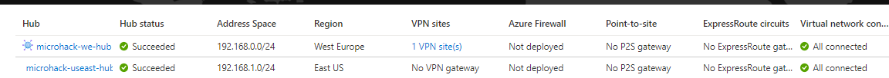

## Task 3: Verifiy connectivity and inspect routing
Connect to spoke-1-vm via Bastion. Open Internet Explorer, browse to spoke-3-vm at 172.16.3.4 and to spoke-4-vm at 172.16.4.4.

Do the same from on-prem-vm.

:question: Do you see the web pages from spoke-3-vm and spoke--4vm?

:point_right: Spoke routes

Observe Effective Routes for spoke-1-vm, either in the portal or in Cloud Shell through 

`az network nic show-effective-route-table -g vwan-microhack-spoke-rg -n spoke-1-nic --output table`

:question: Which routes have been added to spoke-1-vm's route table? 

:question: What is the next hop for the new routes?

:exclamation: Realize that Virtual WAN installed these routes into the Spoke 1 VNET automatically!

Now observe Effective Routes for spoke-3-vm, which is in Spoke 3 connected to the US East Hub:

`az network nic show-effective-route-table -g vwan-microhack-spoke-rg -n spoke-3-nic --output table`

:exclamation: Note all routes, both for the US East "local" Spoke 4 and "remote" West Europe destinations, have the address of the Route Service in the US East Hub as their next hop.

Again, realize that Virtual WAN installed these routes in the Spoke VNETs automatically!

### :point_right: BGP routing exchange over VPN
In Cloud Shell, run the branch-routes script:

`./branch-routes.sh`

:question: Compare the AS path of the new routes for Spokes 3 and 4, to the AS path of the routes for Spokes 1 and 2. Why are they different?

:point_right: Hub routes

Observe Effective Routes of the Default route table on the microhack-we-hub, as you did in Scenario 1.

:question: Which routes have been added and where do they point? 

:question: What is the meaning of the AS path?

Then go to Effective Routes of the Default route table on the newly added microhack-eastus-hub.

:question: Where do the routes for Spoke 1 and Spoke 2 (172.16.(1)(2).0/24) and the Branch (10.0.(1)(2).0/24) point?

:question: What is their AS path and how does this compare to what you saw on the West Europe hub? 

:point_right: Association and Propagation

In the portal, in the microhack-vwan blade under Connectivity click Virtual network connections and expand Virtual networks for both Hubs. 

:exclamation: Note that for all 4 connections across both Hubs, under Associated to Route Table it says "defaultRouteTable". 

This means that each connection takes its routing information from the default route table of its *local* hub. This is always the case: the route service in a Hub only programs routing information to its directly connected Spokes.

:exclamation: Under Propagation to Route Tables, it also says "defaultRouteTable". This means that this connection sends its reachability information (i.e. the prefixes behind it) to its *local* default route table only, but *not* to the other Hub.

However, we observed that the defaultRouteTable of the West Europe Hub does have routes for the Spokes in US East and vice versa. 

This happens because under Propagating to labels, there is the entry "default". 

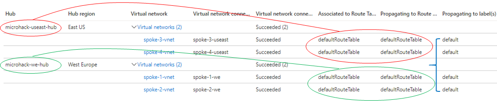

Labels are a method of grouping Route Tables across Hubs, so that they do not have to be specified individually. The defaultRouteTables in all Hubs in a VWAN are automatically included in the "default" label, and Propagation to this label is automatically enabled.

In the next scenario we will explore custom routing patterns enabled by deploying additional routing tables to our hubs.

# Scenario 4: Isolated Spokes and Shared Services Spoke
:exclamation: The following is scenario is quite advanced and will take some time and effort.

Imagine an IT department that must facilitate DevOps teams. IT operates a number of central services, such as the networks in and between Azure and on-premise, and the Active Directory domain.

DevOps teams are given their own VNETs in Azure, connected to a central hub that provides connectivity and the domain. The DevOps teams operate independently and their environments must remain isolated from each other.

This scenario adds a Shared Services Spoke with a Domain Controller, and changes the routing so that the Spokes can only reach the Branch and the Shared Services Spoke, but remain isolated from each other.

Please read [this documentation](https://docs.microsoft.com/en-us/azure/virtual-wan/scenario-shared-services-vnet) for background.

At the end of this Scenario your lab looks like this:

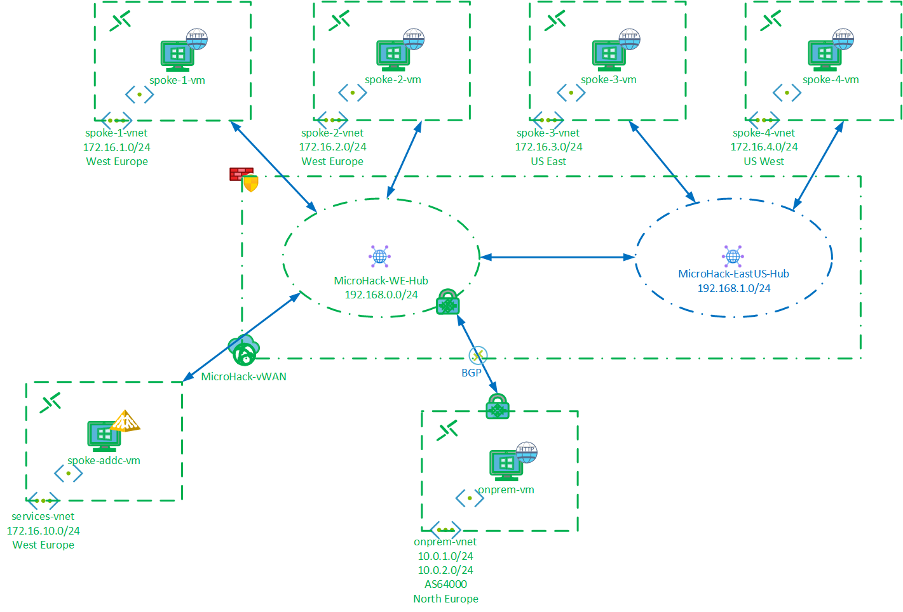

The Spokes can now no longer talk between themselves:

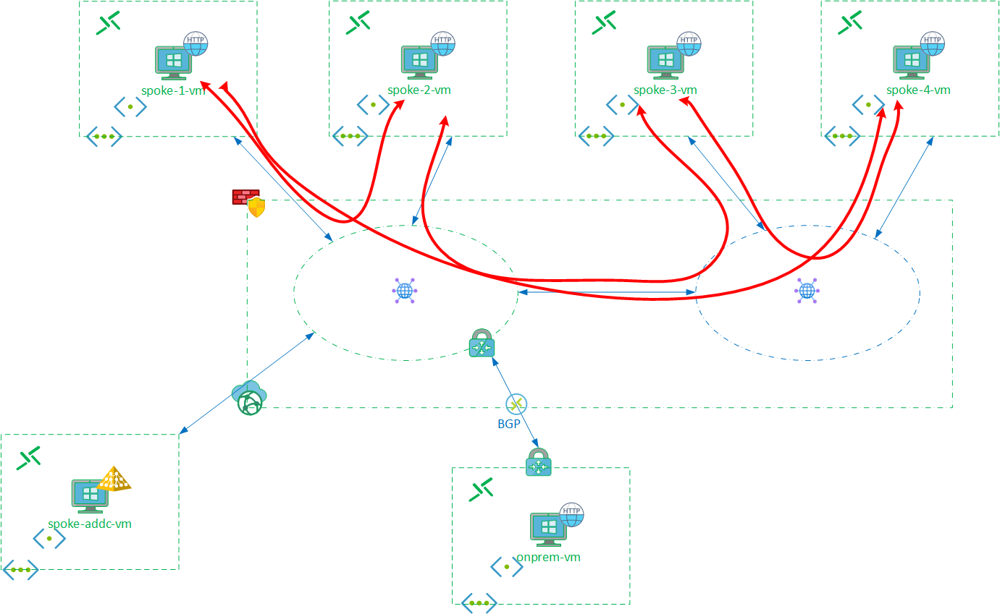

... but communication from the Spokes to the Services VNET and the Branch location is still possible:

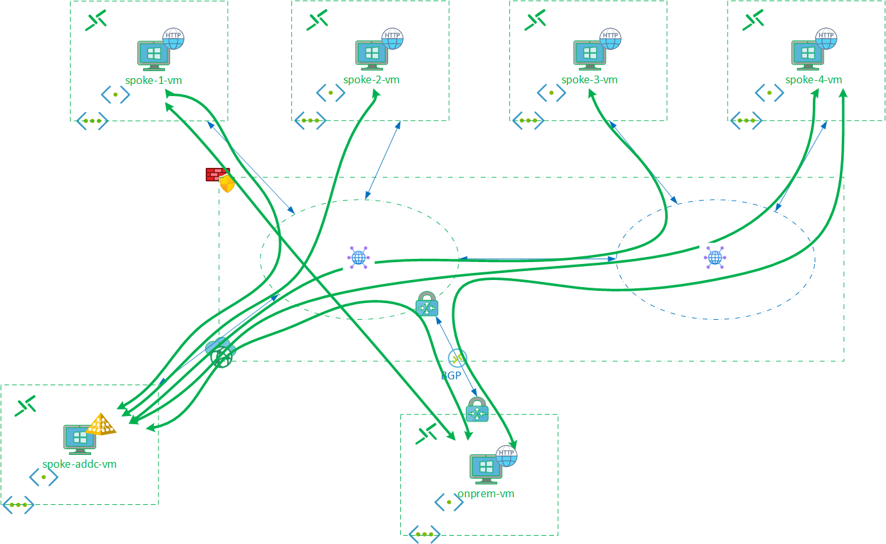

## Task 1: Connect Services Spoke

Run the following in Cloud Shell to connect services-vnet to microhack-we-hub:

`./connect-services-spoke.sh`

Wait for the connection to complete and show status Succeeded in the portal.

## Task 2: Create custom Route Tables

## :hand: West Europe Hub

In the microhack-we-hub, under Connectivity select Routing and then +Create route table. Complete the configuration as follows:
- Tab Basics
  - Name: RT-Shared-we
- Tab Labels
  - Label Name: Shared
- Tab Associations
  - In the drop down under Virtual Networks, select both Spokes but do *not* select services-vnet
- Tab Propagations
  - Under Branches, at Propagate routes from connections to this route table?, select Yes
  - Under Virtual Networks, select services-vnet but do *not* select the Spokes
- Click Create

The Routing view of the West Europe Hub hub now shows 2 connections associated to the Default table (Shared Service Spoke and Branch), and 4 connections propagating to the Default table (both Spokes, Shared Services and Branch).

The RT-Shared-we table has 2 connections associated (both Spokes), and 2 connections propagating (Shared Services and Branch).

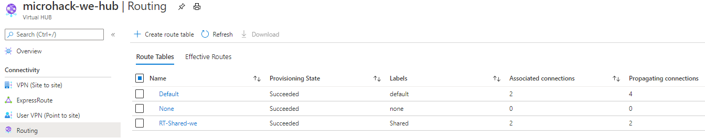 

:exclamation: It may take a few minutes for the changes to complete. If RT-Shared-does not look as expected, edit the table and correct the Associations and Propagations settings per the instructions above.

Before proceeding, ensure that the routing view of microhack-we-hub look as above, and that microhack-we-hub shows Succeeded for Hub status and Routing status.

## :hand: US East Hub

For microhack-useast-hub, under Connectivity select Routing and then +Create route table and complete as follows:
Tab Basics
  - Name: RT-Shared-useast
- Tab Labels
  - Label Name: Shared
- Tab Associations
  - In the drop down under Virtual Networks, select both Spokes.
- Tab Propagations
  - Enter *nothing* because:
    -  We do not want the local Spokes to propagate to this table, as they should not learn each other's routes
    -  The RT-Shared-useast table must only contain routes to the Shared Services Spoke- and the Branch connections, and it will learn these from the West Europe hub via the inter-hub link
  - Click Create

Routing for the US East Hub shows both Spoke VNET connections propagating to the Default route table, and both are associated with the RT-Shared-useast table.

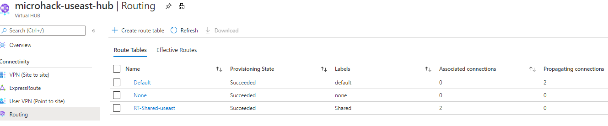 

## :handshake: Cross-region

:exclamation: We must also ensure that the Shared Services VNET connection and the Branch connection, which are connected to the West Europe Hub, *also* propagate to the RT-Shared-useast table.

For the **Shared Services VNET**, this is configured on the connection, and we will use the Shared label which groups the RT-Shared tables in both hubs. 

In the microhack-vwan view, select Virtual network connections. Expand the connections on microhack-we-hub, click the elipsis at the end of the services-vnet row and select Edit. In the Propagate to labels drop-down, select both default and Shared labels, and click Confirm.

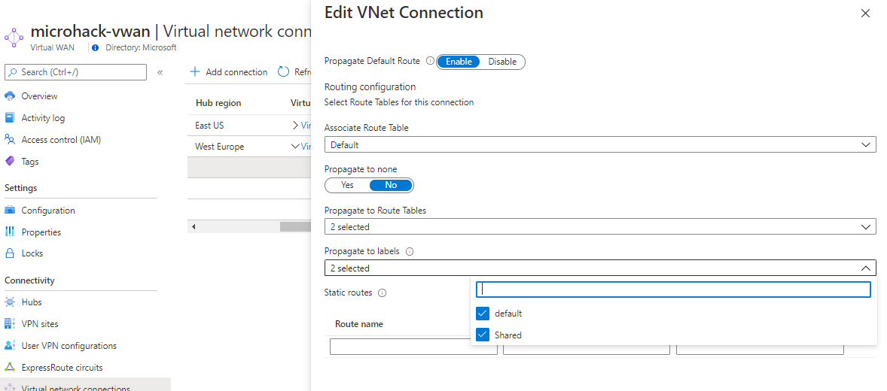 

To let the **Branch** route propagate accross to the East US Hub, the Branches setting in the Propagations tab of RT-Shared-we, the Shared table in the **West Europe** hub, must be updated. Edit RT-Shared-we, click the Propgations tab. Under Branches (Site VPN/ExpressRoute/User VPN) ensure both default and Shared are selected. Click Create.

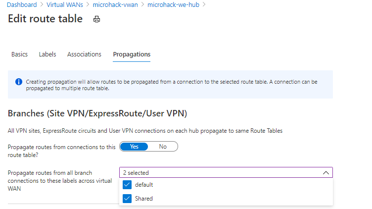

:beetle: **Bug alert** You may see an error message similar to this:

"Deployment template validation failed: 'The resource 'Microsoft.Network/vpnGateways/microhack-we-hub-vng/vpnConnections/onprem' at line '183' and column '9' is defined multiple times in a template."

This is caused by a bug. The work around is to close the portal browser tab, log in to the portal from a fresh tab and redo the operation.

## Task 3: Verify connectivity

Clear the browser cache on spoke-1-vm by pressing CRTL+Shift+Del. From spoke-1-vm, try to browse to any of the other Spokes (172.16.2/3/4.4), and the Branch (10.0.1.4).

:question: Do the web pages of the Spokes and the Branch display?

Try to ping spoke-addc-vm (172.16.10.4).

:question: Does ping succeed?

## Task 4 (Optional): Join Spoke vm to Domain
The Shared Service VNET contains an AD domain controller.

To demonstrate connectivity from the Spokes to the Shared Services VNET, you can optionally join one or more spoke vm's to the domain.
- Point the DNS in spoke-vnet-1 to spoke-addc-vm, in Cloud Shell:

`az network vnet update --name spoke-1-vnet --resource-group vwan-microhack-spoke-rg --dns-servers 172.16.10.4`

- On spoke-1-vm, open a command prompt and enter:
  
`ipconfig /renew`
  
- On spoke-1-vm, open Server Manager and click Local Server. 
- Then click WORKGROUP, click the Change ... button, select the Domain radio button under Member of and enter micro-hack.local, click OK.
- Enter credentials
  - User name: AzureAdmin
  - Password: Microhack2020

The machine will now join the domain and will need to be restarted for this change to take effect.

## Task 5: Inspect routing

:point_right: Spoke routes

View Effective Routes for spoke-1-vm, in the portal or in Cloud Shell:

`az network nic show-effective-route-table -g vwan-microhack-spoke-rg -n spoke-1-nic --output table`

:question: Identify the routes that you see. Which routes are not there and is that as expected?

View Effective Routes for spoke-addc-vm:

`az network nic show-effective-route-table -g vwan-microhack-spoke-rg -n spoke-addc-1-nic --output table`

:question: Again identify the routes that you see. What is different here from the routes at spoke-vm-1?

:point_right: Hub routes

View Effective Routes for the Default table of the West Europe hub: in the portal from microhack-vwan select Hubs, microhack-we-hub, Routing, click Default and View effective routes for this table.

:question: Are routes for the Spokes (172.16.(1)(2)(3)(4).0/24) present? What does that mean for connections Associated with this table?

:exclamation: Click Associations and under Current settings (Routing Configuration), note that spoke-1-vnet and spoke-2-vnet are *not* associated with the defaultRouteTable table, but they *are* propagating to defaultRouteTable.

Go back to the Route Tables view of microhack-we-hub, click RT-Shared-we and then View effective routes for this table.

:question: Are routes for the Spokes (172.16.(1)(2)(3)(4).0/24) present? 

:question: Are routes for the Shared Services VNET (172.16.10.0/24) and the Branch (10.0.(1)(2).0/24) present?

:question: As the Spokes are associated with RT-Shared-we, what does this mean for destinations that the Spokes can reach?

Now view RT-Shared-useast and Default tables for the US East Hub.

:question: what does RT-Shared-useast contain? Why and what does this mean for the Spokes connected to the US East Hub?

:exclamation: Note that the Default table does not contain routes. The Default route table of the US East Hub does not have any connections Associated with it. It does have connections Propagating into it, so should contain routing information. *Apparently* a route table shows empty when it has no connections Associated, i.e. nothing to consume its routing information.

# Close out
You have explored VWAN routing to a good level of detail. As Virtual WAN grows and matures, it is important you have a good understanding of this topic to guide and help customers in a variety of use cases. This MicroHack is available for you to use with your teams, your customers and partners to reinforce their understanding.

Below are optional challenges on network security in Virtual WAN with Network Virtual Appliances and Secured Hubs. Use this content at your own pace to expand your knowledge and skills. 

**If you decide to continue now, skip the clean-up task below and start on Scenario 5.**

## Final Task: Delete all resources

Run this script to delete all resources:

`./clean-up-after-scenario-4.sh`

This may take up to 30 minutes to compete. Remember to verify that all resources have indeed been deleted. 

In Cloud Shell, delete the azure-vwan-microhack directory:

`rm -rf azure-vwan-microhack`

# Scenario 5 (Optional): Filter traffic through a Network Virtual Appliance
Virtual WAN today does not support third party NVA firewalls in the Hub. Third party SD-WAN concentrators from Barracuda and Cisco Viptella are now supported, but that capability does not yet exist for firewall products.

Third party NVA firewalls must therefore be placed in a Spoke, with protected VNETs peered behind.
See https://docs.microsoft.com/en-us/azure/virtual-wan/scenario-route-through-nva for background on this pattern.

This scenario demonstrates how to route traffic through a third party Network Virtual Appliance. We use a single Linux VM with IPTables, with a rule set allowing all traffic. 

At the end of this Scenario your VWAN looks like this:

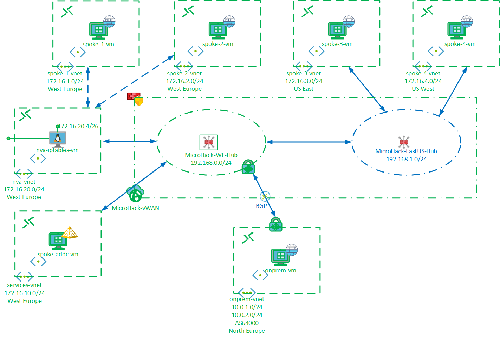

:exclamation: Note that spoke-1-vnet and spoke-2-vnet are now disconnected from the West Europe Hub, and are peered behind a new Spoke containing the NVA. This nva-vnet is connected to Hub.

In this scenario we will manipulate routing to direct traffic to and from spoke-1-vnet and spoke-2-vnet through the NVA. Outbound internet traffic from spoke-1-vnet and spoke-2-vnet will also be directed through the NVA, but we will discover that it is not possible to do so for spoke-3-vnet and spoke-4-vnet.

## Task 1: Prepare the environment
A number of changes must be made to prepare the Virtual WAN for this scenario:
- Reconfigure for Default routing
- Disconnect Spoke 1 and Spoke 2 from the Hub
- Connect the NVA Spoke to the Hub
- Peer Spoke 1 and Spoke 2 with the NVA Spoke

To implement these changes, run this script in Cloud Shell:

`./prep-for-scenario-5.sh`

This will take a few minutes to complete.

## Task 2: Add User Defined Routes
We must now add UDRs to the subnet vmSubnet in both Spoke 1 and Spoke 2 VNETs, to direct all traffic to the NVA in nva-vnet.

Run this script in Cloud Shell:

`./add-udrs-scenario5.sh`

In the portal, verify that a Route table (UDR) named "default-to-nva" has been created, and is associated subnet vmSubnet in both spoke-1-vnet and spoke-2-vnet.

All traffic outbound from spoke-1-vm and spoke-2-vm is now directed to the NVA in nva-vnet.

:exclamation: nva-vnet is already connected to West Europe Hub and has routes programmed by the Route Service, so we do not need to add a UDR manually.

## Task 3: Modify VWAN routing
The Virtual WAN is not aware that Spoke 1 and Spoke 2 are now behind the NVA, so we must update the routing by adding static custom routes for Spoke 1 and Spoke 2 pointing to the NVA.

:exclamation: Note that a static custom route must be added to the Default route table of *both* the West Europe *and* the US East Hubs. It is not sufficient to only a static route to the West Europe Hub, as this route will not propagate to remote hubs.

In the portal, go to the Routing blade of microhack-we-hub. Click the Default route table, and in Basics at the bottom, create a custom route:
- Route name: spoke1-via-nva
- Destination type: leave at CIDR
- Destination prefix: 172.16.1.0/24
- Next hop: select nva-we
- Next Hop IP: now Configure appears, click this and enter 172.16.20.4 under Next Hop IP (this is the IP address of the NVA)

Create a similar entry for Spoke 2 (172.16.2.0/24).

Click Review+create and then Create.

Then go the Routing blade of microhack-useast-hub and do the same. You can skip adding the Next Hop IP as the connection to nva-vnet already has this configuration applied.

## Task 4: Verify connectivity
:point_right: From "protected" VNETs Spoke 1 and Spoke 2

On spoke-1-vm, traceroute and browse to each of the Spokes (172.16.(2)(3)(4).4) and to the Branch (10.0.1.4).

:question: Do all browser connections succeed, what are the first hop addresses?

On spoke-1-vm, traceroute and browse to www.bing.com.

:question: Does the browser connection succeed, what is the first hop address?

:point_right: From "unprotected" VNETs Spoke 3 and Spoke 4

On spoke-3-vm, traceroute and browse to each of the Spokes (172.16.(1)(2)(4).4) and to the Branch (10.0.1.4).

:question: Do all browser connections succeed, what are the first hop addresses?

On spoke-3-vm, traceroute and browse to www.bing.com.

:question: Does the browser connection succeed, what is the first hop address?

## Task 5: Inspect routing

:point_right: Spoke routes

We will first look at the routes of one of the tiered Spokes. This is one of the Spokes connected behind the NVA VNET, no longer connected directlty to the Hub.

View Effective Routes for spoke-1-vm, in the portal or in Cloud Shell:

`az network nic show-effective-route-table -g vwan-microhack-spoke-rg -n spoke-1-nic --output table`

:question: Identify the routes that you see. Comparing to Spoke routes we saw in previous scenario's, which routes are not there and is that as expected? Which route is now present and why?

:exclamation: Realize that VWAN does not have visibility of tiered Spokes and cannot program the routing in the VNET. That is why we had to place UDRs in the tiered Spokes.

View Effective Routes for spoke-3-vm, in the portal or in Cloud Shell:

`az network nic show-effective-route-table -g vwan-microhack-spoke-rg -n spoke-1-nic --output table`

:question: Identify the routes that you see. Comparing to Spoke routes we saw in previous scenario's, is this now different and why (not)?. From the perspective of Spoke 3, has placing Spokes 1 and 2 behind an NVA VNET on the *remote* hub changed its view of the network?

:point_right: Hub routes

View Effective Routes for the Default table of the West Europe hub: in the portal from microhack-vwan select Hubs, microhack-we-hub, Routing, click Default and View effective routes for this table.

:question: Identify the routes for Spokes 1 and 2 (172.16.(1)(2).0/24). Where do they point and how did they get into the table?

Now view Effective Routes for the Default table of the US East hub.

:question: Again identify the routes for Spokes 1 and 2 (172.16.(1)(2).0/24). Where do they point and how did they get into the table?

:exclamation: Note that the routes for the tiered Spokes 1 and 2 in the US East Hub's Default table have the connection to the nva-we VNET listed as next hop. This is somewhat confusing, because the nva-we connection exists on the *remote* West Europe Hub! From perspective of the US East Hub, the next hop for these prefixes really is the West Europe Hub's route service.

:point_right: Outbound internet access

Traffic outbound to the internet from Spokes 1 and 2 is directed to the NVA, and it goes out via the NVA's public IP address. Verify this by browsing to www.whatismyipaddress.com from spoke-1-vm, check that the ip address reported is the public ip of the NVA shown in the portal.

It would be ideal if outbound internet from spoke vnets directly connected to the VWAN, such as Spokes 3 and 4, could be forced through the NVA as well. This requires a custom route in the Hub default route tables, for destination prefix 0.0.0.0/0 pointing to the nva-vnet connection. This is not possible today as VWAN does not support the default route as a custom route entry.

:exclamation: Using a Network Virtual Appliance firewall for outbound internet access from Spokes directly connected to the VWAN is not supported.

# Scenario 6 (Optional): Secured Hubs

This final and optional scenario converts the Hubs into Secured Hubs through Azure Firewall Manager. This operation deploys Azure Firewall into the Hubs.

## Task #1: Restore the Virtual WAN

To put the VWAN back into "default" state, a number of changes must be made:

- Disconnect Spoke 1 and Spoke 2 from the the NVA Spoke
- Remove UDRs from Spoke 1 and Spoke 2 
- Remove custom routes
- Disconnect the NVA Spoke to the Hub
- Connect Spoke 1 and Spoke 2 to the West Europe Hub

To implement these changes, run this script in Cloud Shell:

`./prep-for-scenario-6.sh`

This will take a few minutes to complete.

## Task #2: Convert to Secure Hubs

We are now ready to convert our Virtual Hubs into Secured Hubs through Azure Firewall Manager. We will create a Firewall Policy in the same flow.

:exclamation: Note that Firewall Manager is a separate top-level Azure service; it is not part of Virtual WAN. If you don't have it bookmarked already, find Firewall Manager using the search bar at the top of the portal.

In the Firewall Mananger blade, click Azure Firewall Policies and + Create Azure Firewall Policy.

**Basics**
- Resource group: select vwan-microhack-hub-rg
- Name: microhack-fw-policy
- Region: West Europe

**Rules**
- Click + Add a rule collection
  - Name: default-policy
  - Rule collection type: Network
  - Priority: 100
  - Action: Allow
  - Rules: 
    - Name:  Allow-all
    - Source type: IP Address
    - Source: *
    - Protocol: Any
    - Destination Ports: * 
    - Destination Type: IP Address 
    - Destination: *
  - Click Add

**Hubs**
- Click +Associate virtual hubs
- Select both your hubs
- Click Add

**Review+create**

**Create**

This deploys Azure Firewall into your Hubs and applies the Allow-all policy to both. This operation will take a few minutes to complete.

## Task 3: Secure Internet traffic 

Route settings for your Secured Hubs are managed in Firewall Manager.

In the Firewall Manager blade, click Secured virtual hubs, select microhack-we-hub and then Security configuration.

In the drop downs under Internet traffic and Private traffic, select Azure Firewall and Send via Azure Firewall and click Save. This sets up Azure Firewall as the security provider, and inserts routes pointing to the Azure Firewall for the prefixes listed as Private traffic prefixes (link next to the drop down. Default this is set to the RFC1918 ranges of 10.0.0.0/8, 172.16.0.0/12 and 192.168.0.0/24.

Select all Connections, in the drop down under **Internet traffic** select Azure Firewall and click Save.

:point_right: Spoke routes

In Cloud Shell, pull up Effective routes of spoke-1-vm:

`az network nic show-effective-route-table -g vwan-microhack-spoke-rg -n spoke-1-nic --output table`

:question: where does the default route (0.0.0.0/0) point?

Display the ip addresses of the he Azure Firewall in the secured hub:

`az network firewall show -g vwan-microhack-hub-rg -n AzureFirewall_microhack-we-hub --query hubIpAddresses`

:exclamation: Note that the default route now points to the private (inside) address of the Azure Firewall instance in the secured hub.

On spoke-1-vm, browse to www.whatismyipaddress.com.

:exclamation: Note that the outbound ip address is now the public ip address of the Azure Firewall instance.

## Task 4: Secure Private traffic

To be added, this is pending service update enabling V-SH-SH-V pattern.

# Close out
You have explored VWAN routing to a good level of detail. As Virtual WAN grows and matures, it is important you have a good understanding of the subject, to guide and help customers in a variety of use cases.

This MicroHack is available for you to use with your teams, your customers and partners to reinforce their understanding.

## Final Task: Delete all resources

Delete the vwan-microhack-hub-rg and vwan-microhack-spoke-rg resource groups. This may take up to 30 minutes to compete. Check back to verify that all resources have indeed been deleted.

In Cloud Shell, delete the azure-vwan-microhack directory:

`rm -rf azure-vwan-microhack`
